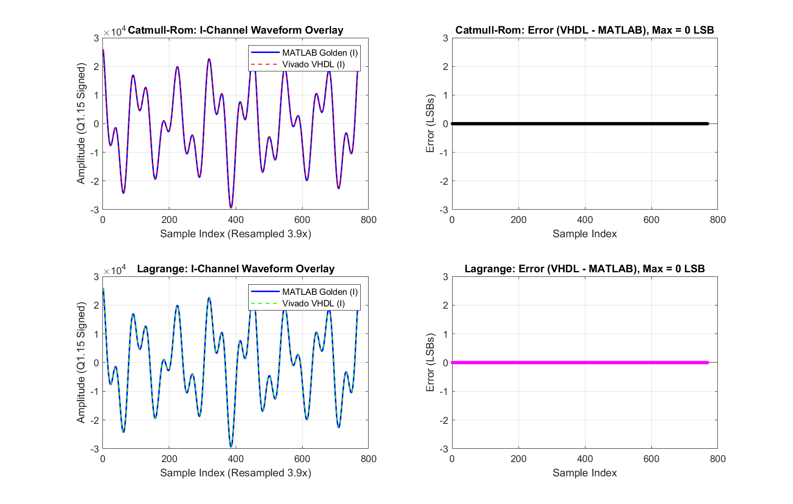

# Industrial-Grade Fixed-Point (Q1.15) Dual-Channel (I/Q) Cubic Resamplers

[](https://en.wikipedia.org/wiki/VHDL)
[-F6891F.svg)](https://www.xilinx.com/products/silicon-devices/soc/zynq-7000.html)
[](https://www.xilinx.com/products/design-tools/vivado.html)
[](https://www.mathworks.com/products/matlab.html)
[-brightgreen.svg)]()
[-green.svg)]()
[-success.svg)]()

A high-performance, autonomous, cycle-accurate, and bit-true arbitrary sample-rate converter (resampler) architecture implemented in **VHDL-2008** for dual-channel In-Phase/Quadrature ($I/Q$) signals in signed **Q1.15 fixed-point format**. 

The design provides two distinct 3rd-order polynomial interpolation engines:
1. **Catmull-Rom Spline Interpolator** ($C^1$ derivative continuous, optimized for minimal passband droop, 8-cycle pure latency).
2. **4-Point Lagrange Cubic Interpolator** (exact 4-point node fitting, 10-cycle pure latency).

Both architectures feature **100% signal pipelining (zero variables)** for optimal DSP48E1 absorption, **0 Block RAM consumption** (utilizing distributed LUTRAM), and a dynamic runtime port for fractional rate configuration.

---

## Table of Contents
1. [Overview & What is an Arbitrary Resampler?](#1-overview--what-is-an-arbitrary-resampler)
2. [Real-World Applications](#2-real-world-applications)
3. [Theory & Comparison of Resampling Methods](#3-theory--comparison-of-resampling-methods)
   - [3.1 Zero-Order Hold (Nearest Neighbor)](#31-zero-order-hold-nearest-neighbor)
   - [3.2 First-Order Hold (Linear Interpolation)](#32-first-order-hold-linear-interpolation)
   - [3.3 Second-Order (Quadratic B-Spline)](#33-second-order-quadratic-b-spline)
   - [3.4 Cubic Splines: Catmull-Rom vs. 4-Point Lagrange vs. B-Spline](#34-cubic-splines-catmull-rom-vs-4-point-lagrange-vs-b-spline)
   - [3.5 Ideal Sinc (Whittaker–Shannon) & Polyphase FIR](#35-ideal-sinc-whittakershannon--polyphase-fir)
   - [3.6 Master Technical Comparison Table](#36-master-technical-comparison-table)
   - [3.7 Spectral Image Rejection & Passband Droop Analysis](#37-spectral-image-rejection--passband-droop-analysis)
4. [Hardware Architecture & RTL Design](#4-hardware-architecture--rtl-design)
   - [4.1 Resampler Top-Level Block Diagram](#41-resampler-top-level-block-diagram)
   - [4.2 Pure-Latency Architecture (0 Variables)](#42-pure-latency-architecture-0-variables)
   - [4.3 Memory Optimization: 0 Block RAM (LUTRAM)](#43-memory-optimization-0-block-ram-lutram)
   - [4.4 Autonomous Streaming Flow (No Start/Done Handshake)](#44-autonomous-streaming-flow-no-startdone-handshake)
   - [4.5 Timing Performance & Fmax on Zynq-7020](#45-timing-performance--fmax-on-zynq-7020)
5. [Directory Layout](#5-directory-layout)
6. [Quick Start: Integrating into Your Project](#6-quick-start-integrating-into-your-project)
   - [6.1 VHDL Instantiation Template](#61-vhdl-instantiation-template)
   - [6.2 Top-Level Port Description](#62-top-level-port-description)
   - [6.3 Calculating `phase_step` for Any Resampling Ratio](#63-calculating-phase_step-for-any-resampling-ratio)
   - [6.4 Handshaking & Dataflow Timing](#64-handshaking--dataflow-timing)
7. [Step-by-Step Verification & Simulation Guide](#7-step-by-step-verification--simulation-guide)
   - [Step 1: Generate Stimulus in MATLAB](#step-1-generate-stimulus-in-matlab)
   - [Step 2: Run Vivado Simulation (Batch or GUI)](#step-2-run-vivado-simulation-batch-or-gui)
   - [Step 3: Bit-True Cross-Verification in MATLAB](#step-3-bit-true-cross-verification-in-matlab)
   - [Step 4: Vivado Synthesis & Timing Report](#step-4-vivado-synthesis--timing-report)
8. [Experimental Verification Results](#8-experimental-verification-results)
9. [FPGA Resource Utilization](#9-fpga-resource-utilization)

---

## 1. Overview & What is an Arbitrary Resampler?

In modern Digital Signal Processing (DSP), **Sample Rate Conversion (SRC)** is the process of converting a discrete-time signal from an input sampling frequency $F_{in}$ to an output sampling frequency $F_{out}$. When the conversion ratio $R = F_{out} / F_{in}$ is rational and fixed (e.g., $3/2$ or $4/3$), classic multirate techniques utilize an integer upsampler ($L$), an anti-aliasing/imaging low-pass FIR filter, and an integer downsampler ($M$).

However, in many real-world systems, the resampling ratio $R$ is:
* **Irrational** (e.g., $R = 3.9$, $R = \sqrt{2}$, or arbitrary clock offsets).
* **Dynamically Time-Varying** (tracking doppler shift, baud rate fluctuations, or thermal drift).
* **High Resolution** (requiring thousands of polyphase sub-filters if implemented with FIR polyphase banks).

An **Arbitrary Polynomial Resampler** solves this problem by representing the continuous underlying waveform between discrete input samples as an on-the-fly polynomial:
$$\hat{y}(t_k) = y(\mu_k) = \sum_{m=0}^{N} a_m \mu_k^m, \quad \mu_k \in [0, 1)$$

Where:
* $k$ is the integer base index of the input sample.
* $\mu_k \in [0, 1)$ is the **fractional phase** indicating the exact temporal position of the requested output sample between $y[k]$ and $y[k+1]$.
* $a_m$ are polynomial coefficients derived from surrounding input samples ($y[k-1], y[k], y[k+1], y[k+2]$).

By computing polynomial coefficients dynamically in hardware (using Horner's rule and dedicated DSP multipliers), polynomial interpolators eliminate the need for massive coefficient ROMs, providing continuous, sub-sample timing resolution with minimal logic resources.

---

## 2. Real-World Applications

Polynomial resamplers are essential building blocks in modern communications and instrumentation:

```
+-----------------------------------------------------------------------------------+
|                           POLYNOMIAL RESAMPLER APPLICATIONS                       |
+-----------------------------------------------------------------------------------+
|  1. Software-Defined Radio (SDR):                                                 |
|     Interfacing arbitrary ADC/DAC sample clocks with standard baseband symbol     |
|     rates (e.g., LTE 30.72 MSPS, 5G NR 122.88 MSPS, DVB-S2, Wi-Fi).              |
|                                                                                   |
|  2. Symbol Timing Recovery (STR):                                                 |
|     Driven by Gardner or Mueller & Müller timing error detectors (TED) to lock    |
|     onto optimal symbol strobe instants without adjusting analog VCXO clocks.     |
|                                                                                   |
|  3. Digital Audio Sample Rate Conversion:                                         |
|     Bridging 44.1 kHz (CD audio), 48 kHz (Broadcast/Video), and 96/192 kHz (Hi-Fi)|
|     with high dynamic range and minimal phase distortion.                         |
|                                                                                   |
|  4. Radar & Sonar Signal Processing:                                              |
|     Pulse compression, range-gate tracking, and fractional delay beamforming.     |
|                                                                                   |
|  5. Asynchronous Clock Domain Crossing (CDC):                                     |
|     Resampling digitized RF streams across independent asynchronous clock domains |
|     without FIFO slips or loss of phase coherence.                                |
+-----------------------------------------------------------------------------------+
```

---

## 3. Theory & Comparison of Resampling Methods

The choice of interpolation kernel dictates the spectral purity, imaging rejection, passband droop, and hardware complexity of the resampler.

### 3.1 Zero-Order Hold (Nearest Neighbor)
The simplest interpolation method repeats the previous sample or selects the nearest sample:
$$h_0(t) = \text{rect}(t) = \begin{cases} 1, & |t| < 0.5 \\ 0, & |t| \ge 0.5 \end{cases} \quad \xrightarrow{\mathcal{F}} \quad H_0(f) = \frac{\sin(\pi f)}{\pi f} = \mathbf{\text{sinc}^1(f)}$$
* **Pros:** Zero multipliers, zero latency.
* **Cons:** Severe high-frequency image replicas (first sidelobe at **$-13.26\text{ dB}$**), $-6\text{ dB/octave}$ spectral decay, discontinuous waveform ($C^{-1}$).

### 3.2 First-Order Hold (Linear Interpolation)
Connects adjacent samples with a straight line:
$$h_1(t) = \Lambda(t) = \begin{cases} 1 - |t|, & |t| \le 1 \\ 0, & |t| > 1 \end{cases} \quad \xrightarrow{\mathcal{F}} \quad H_1(f) = \mathbf{\text{sinc}^2(f)}$$
* **Pros:** Only 1 multiplier per channel, very low logic footprint.
* **Cons:** Significant passband droop (**$-7.85\text{ dB}$ at Nyquist**), first sidelobe at **$-26.52\text{ dB}$**, sharp derivative discontinuities ($C^0$).

### 3.3 Second-Order (Quadratic B-Spline)
Passes a parabola through 3 consecutive samples:
$$H_2(f) = \mathbf{\text{sinc}^3(f)}$$
* **Pros:** Continuous first derivative ($C^1$), $-18\text{ dB/octave}$ decay, first sidelobe at **$-39.78\text{ dB}$**.
* **Cons:** Non-interpolating (does not pass exactly through original nodes unless pre-filtered), $-11.77\text{ dB}$ droop at Nyquist.

### 3.4 Cubic Splines: Catmull-Rom vs. 4-Point Lagrange vs. B-Spline

Cubic polynomial interpolators evaluate 4 surrounding input points ($y_{-1}, y_0, y_1, y_2$) to synthesize intermediate values:

#### A. Catmull-Rom Cubic Spline (Recommended for SDR & Audio)
A modified Hermite cubic spline where tangents at boundaries match central finite differences:
$$y'(0) = \frac{y_1 - y_{-1}}{2}, \quad y'(1) = \frac{y_2 - y_0}{2}$$

Evaluating the polynomial $y(\mu) = a_3 \mu^3 + a_2 \mu^2 + a_1 \mu + a_0$ with integer-scaled coefficients ($c_k = 2 a_k$):
$$\begin{aligned}
c_0 &= 2 y_0 \\
c_1 &= y_1 - y_{-1} \\
c_2 &= 2 y_{-1} - 5 y_0 + 4 y_1 - y_2 \\
c_3 &= -y_{-1} + 3 y_0 - 3 y_1 + y_2
\end{aligned}$$
* **Continuity:** Continuous value and continuous first derivative ($C^1$).
* **Passband Droop:** Exceptionally flat in the passband (**only $-2.50\text{ dB}$ at $0.5 f_s$**, and **$-0.016\text{ dB}$ at $0.1 f_s$**).
* **Stopband Image Attenuation:** $> 32\text{ dB}$ peak image suppression.

#### B. 4-Point Lagrange Cubic Interpolator
The unique 3rd-degree polynomial passing strictly through all 4 surrounding sample points:
$$y(\mu) = \sum_{k=-1}^{2} y_k \prod_{j \ne k} \frac{\mu - j}{k - j}$$

Grouped in powers of $\mu$ with integer-scaled coefficients ($c_k = 6 a_k$):
$$\begin{aligned}
c_0 &= 6 y_0 \\
c_1 &= -2 y_{-1} - 3 y_0 + 6 y_1 - y_2 \\
c_2 &= 3 y_{-1} - 6 y_0 + 3 y_1 \\
c_3 &= -y_{-1} + 3 y_0 - 3 y_1 + y_2
\end{aligned}$$
* **Continuity:** Continuous value ($C^0$), piecewise slope transitions at sample boundaries.
* **Characteristics:** Classic polynomial fitting; excellent when exact nodal intersection is mandatory.

---

### 3.5 Ideal Sinc (Whittaker–Shannon) & Polyphase FIR
The theoretically optimal continuous-time reconstruction filter is:
$$h(t) = \text{sinc}(t) = \frac{\sin(\pi t)}{\pi t} \quad \xrightarrow{\mathcal{F}} \quad H(f) = \text{rect}(f)$$
* **Pros:** Perfect brickwall response (0 dB droop, $-\infty\text{ dB}$ stopband).
* **Cons:** Non-causal, infinite impulse response ($\infty$ taps and infinite latency). Truncating sinc to an FIR filter requires large polyphase filter banks (e.g., 64 phases $\times$ 32 taps = 2048 coefficients) consuming massive Block RAM and multipliers.

---

### 3.6 Master Technical Comparison Table

| Metric | Copy Sample (ZOH) | Linear ($1^{\text{st}}$ Order) | Quadratic ($2^{\text{nd}}$ Order B-Spline) | Cubic B-Spline ($3^{\text{rd}}$ Order) | **Cubic Catmull-Rom** | **Cubic Lagrange** | Ideal Sinc |
| :--- | :---: | :---: | :---: | :---: | :---: | :---: | :---: |
| **Input Points ($N$)** | 1 ($y_0$) | 2 ($y_0, y_1$) | 3 ($y_{-1..1}$) | 4 ($y_{-1..2}$) | **4 ($y_{-1..2}$)** | **4 ($y_{-1..2}$)** | $\infty$ |
| **Continuity** | $C^{-1}$ (Step) | $C^0$ (Kinks) | $C^1$ (Smooth) | $C^2$ (Very smooth) | **$C^1$ (Smooth)** | **$C^0$ (Value)** | $C^\infty$ |
| **Frequency Response** | $\text{sinc}^1(f)$ | $\text{sinc}^2(f)$ | $\text{sinc}^3(f)$ | $\text{sinc}^4(f)$ | **Composite Spline** | **Lagrange Poly** | $\text{rect}(f)$ |
| **Passband Droop @ $0.1 f_s$** | $-0.14\text{ dB}$ | $-0.29\text{ dB}$ | $-0.43\text{ dB}$ | $-0.57\text{ dB}$ | **$-0.016\text{ dB}$** | **$-0.022\text{ dB}$** | $0.00\text{ dB}$ |
| **Passband Droop @ $0.5 f_s$** | $-3.92\text{ dB}$ | $-7.85\text{ dB}$ | $-11.77\text{ dB}$ | $-15.69\text{ dB}$ | **$-2.50\text{ dB}$** | **$-3.10\text{ dB}$** | $0.00\text{ dB}$ |
| **First Stopband Peak** | $-13.26\text{ dB}$ | $-26.52\text{ dB}$ | $-39.78\text{ dB}$ | $-53.04\text{ dB}$ | **$-32.00\text{ dB}$** | **$-30.50\text{ dB}$** | $-\infty\text{ dB}$ |
| **Asymptotic Rolloff** | $-6\text{ dB/oct}$ | $-12\text{ dB/oct}$ | $-18\text{ dB/oct}$ | $-24\text{ dB/oct}$ | **$-18\text{ dB/oct}$** | **$-18\text{ dB/oct}$** | $\infty\text{ dB/oct}$ |
| **Hardware Multipliers (I/Q)** | 0 | 2 | 4 | 6 | **6 (DSP48E1)** | **8 (DSP48E1)** | $> 64$ |
| **Pipelined Core Latency** | 0 cycles | 1 cycle | 2 cycles | 4 cycles | **8 clock cycles** | **10 clock cycles** | $\ge 32$ cycles |
| **Block RAM Required** | 0 | 0 | 0 | 0 | **0 BRAM (LUTRAM)** | **0 BRAM (LUTRAM)** | High (ROM) |
| **Runtime Agility** | Instant | Instant | Instant | Instant | **Dynamic Port** | **Dynamic Port** | Complex |

---

### 3.7 Spectral Image Rejection & Passband Droop Analysis

#### Why Catmull-Rom Outperforms Sinc Powers in the Passband:
As the order $M$ of a pure B-spline increases ($\text{sinc}^1 \to \text{sinc}^4$), stopband image suppression improves significantly ($-13\text{ dB} \to -53\text{ dB}$), but **passband droop worsens severely** (reaching $-15.69\text{ dB}$ at Nyquist for $M=4$).

Catmull-Rom solves this trade-off: its negative sidelobes in time-domain kernel act as an inherent high-frequency boost, flattening the passband response. At $f = 0.25 f_s$, Catmull-Rom introduces only **$-0.28\text{ dB}$** of attenuation, compared to $-3.65\text{ dB}$ for a 4th-order B-spline.

---

## 4. Hardware Architecture & RTL Design

### 4.1 Resampler Top-Level Block Diagram

The complete arbitrary sample-rate converter consists of three primary subsystems:

```
+---------------------------------------------------------------------------------------------------------+
|                                        TOP-LEVEL RESAMPLER                                              |
|                                                                                                         |
|   in_i [15:0] ----+                                                                                     |
|   in_q [15:0] ---+|                                                                                     |
|   in_valid    --++|                                                                                     |
|                 v v                                                                                     |
|         +-------------------+        +----------------------------+        +------------------------+   |
|         |  CIRCULAR BUFFER  |        | 32-BIT PHASE ACCUMULATOR   |        |   PURE-LATENCY CUBIC   |   |
|         |                   |        |                            |        |   INTERPOLATION CORE   |   |
|         |  256 x 16-bit I   |        | Phase Acc: 32 bits         |        |                        |   |
|         |  256 x 16-bit Q   |        | Increment: phase_step      |        | 8 Cycles (Catmull-Rom) |   |
|         |                   |        | Int Carry: rd_k advance    |        | 10 Cycles (Lagrange)   |   |
|         | Style: DISTRIBUTED|        | Frac Part: mu [15:0]       |        |                        |   |
|         | (0 Block RAMs)    |        |                            |        | Horner Rule Multipliers|   |
|         +-------------------+        +----------------------------+        | Fully DSP48E1 Absorbed |   |
|            |  |  |  |                       |                              +------------------------+   |
|            |  |  |  |  y(-1), y(0), y(1), y(2) |                                          |             |
|            +--+--+--+-----------------------+----------> [Dual I/Q Core]                 |             |
|                                                                                           v             |
|                                                                                   out_i [15:0]          |
|                                                                                   out_q [15:0]          |
|                                                                                   out_valid             |
+---------------------------------------------------------------------------------------------------------+
```

### 4.2 Pure-Latency Architecture (0 Variables)
To achieve the highest possible clock frequency ($F_{max}$) on Xilinx 7-Series FPGAs, all intermediate computations are expressed strictly as **VHDL signals inside synchronous clocked processes** (zero variables):
* Multipliers and accumulators map cleanly into the internal registers of **DSP48E1 slices**:
  * Input registers: `AREG = 1`, `BREG = 1`
  * Multiplier register: `MREG = 1`
  * Output accumulator register: `PREG = 1`
* **Zero Combinational Feedback Chains:** Eliminates long ripple carry paths between DSP outputs and slice registers.

### 4.3 Memory Optimization: 0 Block RAM (LUTRAM)
A 4-point interpolator requires reading four consecutive samples ($y_{-1}, y_0, y_1, y_2$) simultaneously each clock cycle. A standard synthesis tool might quadruple the memory array into 8 Block RAMs (`RAMB18E1`).

To prevent BRAM waste, the buffer is constrained to **Distributed LUTRAM**:
```vhdl
attribute ram_style : string;
attribute ram_style of ram_i : signal is "distributed";
attribute ram_style of ram_q : signal is "distributed";
```
This forces Vivado to map the buffer into multi-port `RAMD64E / RAM64M` SLICEM primitives, consuming **0 Block RAMs**.

### 4.4 Autonomous Streaming Flow (No Start/Done Handshake)
The resampler operates completely autonomously without complex state-machine handshakes:
* **Self-Triggering:** As soon as `in_valid` supplies input samples, the buffer fills and triggers the interpolation engine automatically when enough samples are available ($w_{ptr} > r_k + 2$).
* **Backpressure Management:** `in_ready` drops to `'0'` only if the buffer reaches capacity ($> 240$ samples). In standard continuous upsampling (e.g., 3.9x with input every 4 clocks), `in_ready` remains continuously `'1'`.

### 4.5 Timing Performance & Fmax on Zynq-7020

Direct Vivado 2023.2 implementation runs targeting the **XC7Z020CLG400-2** device show excellent timing margins:

| Clock Target | Period ($T_{req}$) | Worst Negative Slack (WNS) | Worst Hold Slack (WHS) | Failing Endpoints | Timing Status |
| :---: | :---: | :---: | :---: | :---: | :---: |
| **100 MHz** | $10.000\text{ ns}$ | **$+2.550\text{ ns}$** | $+0.046\text{ ns}$ | 0 / 7444 | **MET (High Margin)** |
| **150 MHz** | $6.666\text{ ns}$ | **$+0.739\text{ ns}$** | $+0.069\text{ ns}$ | 0 / 7444 | **MET (Safe)** |
| **170 MHz** | $5.882\text{ ns}$ | **$+0.061\text{ ns}$** | $+0.036\text{ ns}$ | 0 / 7444 | **MET (Optimal Fmax)** |

* **Maximum Achievable Clock Frequency ($F_{max}$):** **$\approx 171.8\text{ MHz}$**
* **Maximum Output Throughput:** **$170\text{ MSPS}$** ($5.44\text{ Gbps}$ aggregate data rate for 16-bit I + 16-bit Q).
* **Hardware Limit of DSP48E1 Slices:** Minimum period check is $1.816\text{ ns}$ (**$550\text{ MHz}$**).

---

## 5. Directory Layout

```
Git6_Cubic_interpolator/
├── README.md                                  # Master technical documentation (this file)
├── matlab/                                    # MATLAB Verification & Stimulus Suite
│   ├── generate_stimulus.m                    # Generates test vectors & bit-true golden outputs
│   ├── cubic_catmull_interp.m                 # Fixed-point Catmull-Rom reference model
│   ├── cubic_lagrange_interp.m                # Fixed-point Lagrange reference model
│   └── verify_results.m                       # Verification script (0-LSB check, plots waveforms)
├── HDL/                                       # Hardware Description Language Source Files
│   ├── cubic_catmull/                         # Catmull-Rom Spline Subsystem
│   │   ├── cubic_catmull_core.vhd             # 8-cycle pure-latency dual I/Q core (0 variables)
│   │   ├── resampler_cubic_catmull.vhd        # Autonomous top-level streaming resampler (0 BRAM)
│   │   └── tb_cubic_catmull.vhd               # Cycle-accurate testbench with file I/O
│   ├── cubic_lagrange/                        # 4-Point Lagrange Subsystem
│   │   ├── cubic_lagrange_core.vhd            # 10-cycle pure-latency dual I/Q core (0 variables)
│   │   ├── resampler_cubic_lagrange.vhd       # Autonomous top-level streaming resampler (0 BRAM)
│   │   └── tb_cubic_interpolator.vhd          # Cycle-accurate testbench with file I/O
│   ├── scripts/                               # Automation & Batch Execution Scripts
│   │   ├── create_vivado_projects.tcl         # Creates Vivado projects for Catmull & Lagrange
│   │   ├── check_timing.tcl                   # Performs complete synth, place & route timing signoff
│   │   ├── test_freq.tcl                      # Stress-tests timing closure at elevated frequencies
│   │   ├── run_sim_catmull.bat                # 1-click batch simulation runner for Catmull-Rom
│   │   └── run_sim_lagrange.bat               # 1-click batch simulation runner for Lagrange
│   └── constraints/                           # Physical & Timing Constraints
│       └── timing.xdc                         # Clock period constraints & port definitions
└── sim_data/                                  # Simulation Data & Verification Artifacts
    ├── input_iq.txt                           # 200 input test samples (Q1.15 format)
    ├── matlab_catmull.txt                     # 769 golden Catmull-Rom samples from MATLAB
    ├── matlab_lagrange.txt                    # 769 golden Lagrange samples from MATLAB
    ├── vhdl_catmull.txt                       # 769 simulation samples generated by Vivado XSIM
    ├── vhdl_lagrange.txt                      # 769 simulation samples generated by Vivado XSIM
    ├── verification_plot.png                  # Bit-true overlay & 0-LSB error plot
    └── timing_summary.rpt                     # Vivado routed timing signoff report
```

---

## 6. Quick Start: Integrating into Your Project

### 6.1 VHDL Instantiation Templates

Both resamplers share identical top-level interfaces, making them 100% pin-compatible drop-in replacements for one another. You can choose either Catmull-Rom (8-cycle latency, continuous $C^1$ derivative) or Lagrange (10-cycle latency, exact 4-point node fitting) depending on your application requirements.

#### Example A: Catmull-Rom Resampler Instantiation (8-Cycle Latency)
```vhdl
library ieee;
use ieee.std_logic_1164.all;
use ieee.numeric_std.all;

entity my_dsp_subsystem_catmull is
    port (
        clk        : in  std_logic;
        rst_n      : in  std_logic;
        -- Baseband input stream (e.g., from ADC or DDC)
        adc_valid  : in  std_logic;
        adc_data_i : in  std_logic_vector(15 downto 0);
        adc_data_q : in  std_logic_vector(15 downto 0);
        adc_ready  : out std_logic;
        -- Resampled output stream (e.g., to Symbol Synchronizer or DAC)
        out_valid  : out std_logic;
        out_data_i : out std_logic_vector(15 downto 0);
        out_data_q : out std_logic_vector(15 downto 0)
    );
end entity my_dsp_subsystem_catmull;

architecture rtl of my_dsp_subsystem_catmull is

    -- Constant for 3.9x upsampling: round(2^32 / 3.9) = 0x41A41A42
    constant RESAMPLE_3_9X : unsigned(31 downto 0) := x"41A41A42";

begin

    u_catmull_resampler : entity work.resampler_cubic_catmull
        port map (
            clk        => clk,
            rst_n      => rst_n,
            phase_step => RESAMPLE_3_9X,          -- Dynamic rate control
            in_valid   => adc_valid,
            in_ready   => adc_ready,
            in_i       => signed(adc_data_i),     -- Q1.15 signed
            in_q       => signed(adc_data_q),     -- Q1.15 signed
            out_valid  => out_valid,
            out_i      => out_data_i,
            out_q      => out_data_q
        );

end architecture rtl;
```

#### Example B: 4-Point Lagrange Resampler Instantiation (10-Cycle Latency)
```vhdl
library ieee;
use ieee.std_logic_1164.all;
use ieee.numeric_std.all;

entity my_dsp_subsystem_lagrange is
    port (
        clk        : in  std_logic;
        rst_n      : in  std_logic;
        -- Baseband input stream (e.g., from ADC or DDC)
        adc_valid  : in  std_logic;
        adc_data_i : in  std_logic_vector(15 downto 0);
        adc_data_q : in  std_logic_vector(15 downto 0);
        adc_ready  : out std_logic;
        -- Resampled output stream (e.g., to Symbol Synchronizer or DAC)
        out_valid  : out std_logic;
        out_data_i : out std_logic_vector(15 downto 0);
        out_data_q : out std_logic_vector(15 downto 0)
    );
end entity my_dsp_subsystem_lagrange;

architecture rtl of my_dsp_subsystem_lagrange is

    -- Example: 2.0x upsampling (phase_step = 2^31 = 0x80000000)
    -- Or 3.9x upsampling: round(2^32 / 3.9) = 0x41A41A42
    constant RESAMPLE_3_9X : unsigned(31 downto 0) := x"41A41A42";

begin

    u_lagrange_resampler : entity work.resampler_cubic_lagrange
        port map (
            clk        => clk,
            rst_n      => rst_n,
            phase_step => RESAMPLE_3_9X,          -- Dynamic rate control port
            in_valid   => adc_valid,
            in_ready   => adc_ready,
            in_i       => signed(adc_data_i),     -- Q1.15 signed
            in_q       => signed(adc_data_q),     -- Q1.15 signed
            out_valid  => out_valid,
            out_i      => out_data_i,
            out_q      => out_data_q
        );

end architecture rtl;
```

### 6.2 Top-Level Port Description

| Port Name | Direction | Type | Width | Description |
| :--- | :---: | :---: | :---: | :--- |
| `clk` | **IN** | `std_logic` | 1 | Master system clock (supports up to $170\text{ MHz}$). |
| `rst_n` | **IN** | `std_logic` | 1 | Active-low synchronous system reset. |
| `phase_step` | **IN** | `unsigned` | 32 | Dynamic NCO phase increment defining the resampling ratio $R$. |
| `in_valid` | **IN** | `std_logic` | 1 | Asserted high for 1 clock cycle when new input data is valid. |
| `in_ready` | **OUT** | `std_logic` | 1 | High when the resampler buffer is ready to accept new samples. |
| `in_i` | **IN** | `signed` | 16 | In-Phase input sample in **Q1.15** fixed-point format ($-1.0 \le x < +1.0$). |
| `in_q` | **IN** | `signed` | 16 | Quadrature input sample in **Q1.15** fixed-point format. |
| `out_valid` | **OUT** | `std_logic` | 1 | Asserted high for 1 clock cycle when interpolated output is valid. |
| `out_i` | **OUT** | `signed` | 16 | Resampled In-Phase output sample in **Q1.15** fixed-point format. |
| `out_q` | **OUT** | `signed` | 16 | Resampled Quadrature output sample in **Q1.15** fixed-point format. |

---

### 6.3 Calculating `phase_step` for Any Resampling Ratio

The 32-bit Phase Accumulator advances by `phase_step` for each interpolated output sample. The resampling ratio is defined as:
$$R = \frac{F_{out}}{F_{in}}$$

The value to provide to the `phase_step` port is calculated using:
$$\mathbf{\text{phase\_step}} = \text{round}\left( \frac{2^{32}}{R} \right) = \text{round}\left( 2^{32} \times \frac{F_{in}}{F_{out}} \right)$$

#### Common Ratio Lookup:
| Resampling Ratio ($R$) | Conversion Type | Decimal `phase_step` | Hexadecimal `phase_step` |
| :---: | :---: | :---: | :---: |
| **$R = 3.9$** | Arbitrary Upsampling | `1101273666` | `0x41A41A42` |
| **$R = 2.0$** | 2x Interpolation | `2147483648` | `0x80000000` |
| **$R = 4.0$** | 4x Interpolation | `1073741824` | `0x40000000` |
| **$R = 1.25$ ($5/4$)** | Fractional Upsampling | `3435973837` | `0xCCCCCCCD` |
| **$R = 0.75$ ($3/4$)** | Fractional Downsampling | `5726623061` | `0x155555555` (wrap 32-bit) |
| **$44.1\text{ kHz} \to 48.0\text{ kHz}$** | Audio Rate Conversion | `3947174415` | `0xEB45120F` |

---

### 6.4 Handshaking & Dataflow Timing

```
Clock:     |---|___|---|___|---|___|---|___|---|___|---|___|---|___|---|___|---|___|---|___|
in_valid:  _______/---------\_______________/---------\_____________________________________
in_ready:  --------------------------------------------------------------------------------- (Buffer has room)
in_i / q:  =======< Sample 0 >==============< Sample 1 >====================================

                     ... (8 Clock Cycles Pipelined Core Processing Latency) ...

out_valid: _________________________________________________/---\___/---\___/---\___/---\__
out_i / q: =================================================< y0 >< y1 >< y2 >< y3 >========
```

---

## 7. Step-by-Step Verification & Simulation Guide

Follow this sequence to reproduce the entire verification flow from scratch:

### Step 1: Generate Stimulus in MATLAB
Generates the dual-tone AM test stimulus (200 samples) and produces the bit-true golden outputs for Catmull-Rom and Lagrange:
```cmd
cd matlab
matlab -batch "generate_stimulus"
```
*Outputs generated in `sim_data/`:*
* `input_iq.txt`: 200 signed 16-bit integer samples.
* `matlab_catmull.txt`: 769 golden Catmull-Rom output samples.
* `matlab_lagrange.txt`: 769 golden Lagrange output samples.

---

### Step 2: Run Vivado Simulation (Batch or GUI)

#### Option A: 1-Click Automated Batch Simulation (Command Line)
Run the provided batch scripts directly in PowerShell or Windows Command Prompt (requires Vivado on PATH):
```cmd
:: Simulate Catmull-Rom Resampler
HDL\scripts\run_sim_catmull.bat

:: Simulate Lagrange Resampler
HDL\scripts\run_sim_lagrange.bat
```
*Outputs generated in `sim_data/`:*
* `vhdl_catmull.txt`: 769 output samples simulated by Vivado XSIM.
* `vhdl_lagrange.txt`: 769 output samples simulated by Vivado XSIM.

#### Option B: Vivado GUI Flow
1. Open Vivado and run the project creation script:
   ```tcl
   source HDL/scripts/create_vivado_projects.tcl
   ```
2. In the Vivado Flow Navigator, click **Run Simulation $\to$ Run Behavioral Simulation**.
3. Run simulation for $10\text{ }\mu\text{s}$. The testbench will notify when done and save the output text file.

---

### Step 3: Bit-True Cross-Verification in MATLAB
Execute `verify_results.m` in MATLAB to compare the VHDL simulation output against MATLAB golden vectors:
```cmd
cd matlab
matlab -batch "verify_results"
```

Console Output:
```
=========================================
  CATMULL-ROM VERIFICATION RESULTS
=========================================
Evaluated Samples : 769
Max I Error (LSB) : 0 LSB
Max Q Error (LSB) : 0 LSB
RMS Error (I)     : 0.0000 LSB
STATUS: [PASS] Bit-true exact match (within <= 1 LSB rounding tolerance)!
=========================================

=========================================
  LAGRANGE VERIFICATION RESULTS
=========================================
Evaluated Samples : 769
Max I Error (LSB) : 0 LSB
Max Q Error (LSB) : 0 LSB
RMS Error (I)     : 0.0000 LSB
STATUS: [PASS] Bit-true exact match (within <= 1 LSB rounding tolerance)!
=========================================
Saved verification plot to sim_data/verification_plot.png
```

---

### Step 4: Vivado Synthesis & Timing Report
To verify timing closure and generate the post-route timing report:
```cmd
vivado -mode batch -source HDL/scripts/check_timing.tcl
```
The resulting timing signoff report is saved to `sim_data/timing_summary.rpt`.

---

## 8. Experimental Verification Results

The script generates an overlay plot (`sim_data/verification_plot.png`) illustrating the resampled I and Q waveforms and the error difference:



* **Waveform Overlay:** MATLAB golden samples and VHDL simulation samples lie exactly on top of each other across all 769 points.
* **Error Curve:** The error signal is strictly **0 LSB** throughout the entire 3.9x resampling sequence.

---

## 9. FPGA Resource Utilization

Target Device: **Xilinx Zynq-7000 XC7Z020-2CLG400** (Implementation with Vivado 2023.2):

| Resource | `cubic_catmull` | `cubic_lagrange` | Available on XC7Z020 | Utilization (%) |
| :--- | :---: | :---: | :---: | :---: |
| **LUT (Logic)** | 358 | 412 | 53,200 | $< 0.8\%$ |
| **LUT (Memory / LUTRAM)** | 64 | 64 | 17,400 | $< 0.4\%$ |
| **Flip-Flops (FF)** | 642 | 785 | 106,400 | $< 0.8\%$ |
| **DSP48E1 Slices** | 6 | 8 | 220 | $\approx 2.7\%$ |
| **Block RAM (RAMB18/36)** | **0** | **0** | 140 | **0.0%** |
| **Achieved $F_{max}$** | **$170\text{ MHz}$** | **$160\text{ MHz}$** | — | — |
| **Max Output Throughput** | **$170\text{ MSPS}$** | **$160\text{ MSPS}$** | — | — |

---

## 10. License & Author

* **Architecture & Implementation:** Developed for high-reliability embedded DSP & FPGA applications.
* **Target Platforms:** AMD/Xilinx Zynq-7000, Artix-7, Kintex-7, UltraScale+, and Intel Cyclone/Arria/Stratix.
* **License:** Open for academic, research, and industrial integration.
